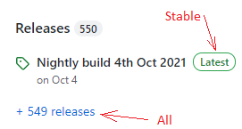

## Download xDrip  
  
To download the latest stable version, go [here](https://github.com/NightscoutFoundation/xDrip/), and go to "Latest".  
  

On a mobile, you will need to scroll almost all the way down to reach Releases and "Latest".  
Download the file with .apk at the end, under "Assets" and install over.  No need to uninstall first.  
Verify, the classic status page first line, that the intended release has been successfully installed.  

To access the nightly builds (least tested but more recent), go to "Releases" on the same page.  
On a mobile, you will need to scroll almost all the way down to reach Releases.  
